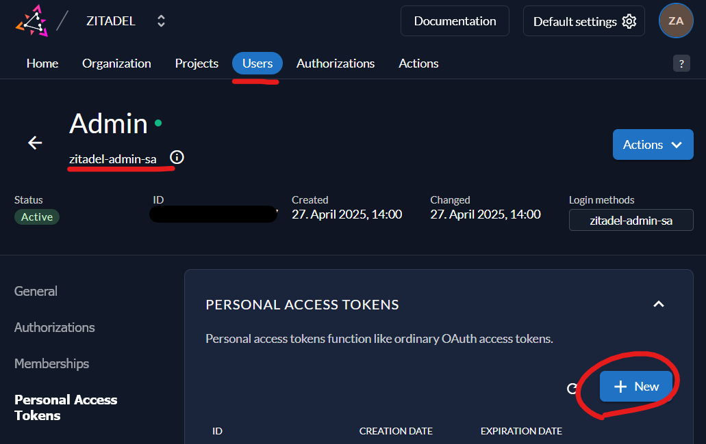
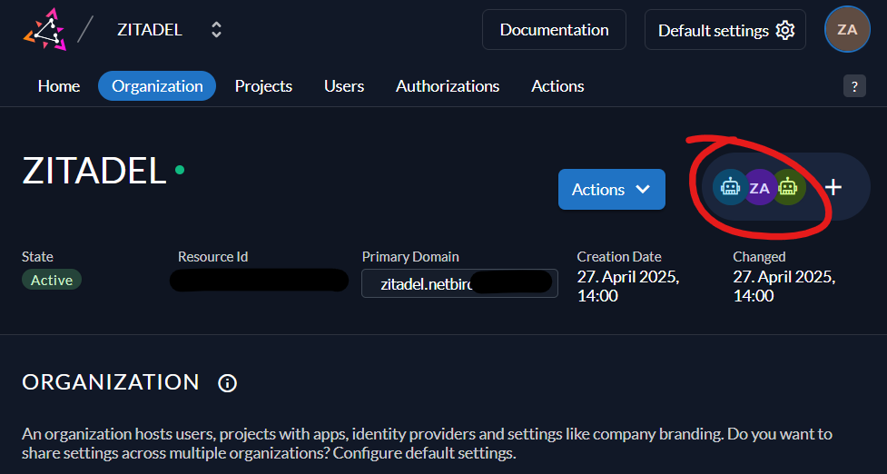
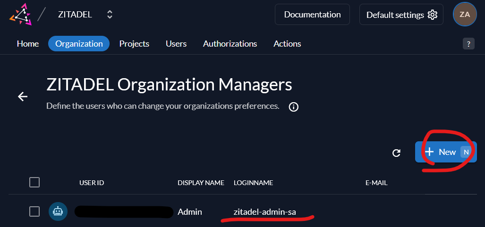
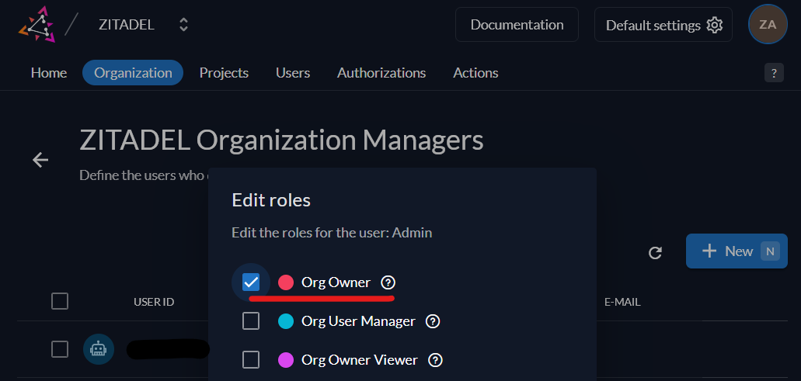

# NetBird migration from Zitadel IdP to embedded Dex IdP

This repository provides a guided migration flow for self-hosted NetBird deployments
that still use the legacy 5-container Docker stack with external Zitadel authentication.

The main script, `netbird-migrate-from-zitadel.sh`, is an attempt to automate the migration as much as possible, as described in the migration:
https://docs.netbird.io/selfhosted/migration/external-to-embedded-idp

## Key features

- Safe by default (`dry-run` first).
- Built-in compatibility check against latest NetBird release.
- Automatic backup creation before destructive changes.
- Automatic `dashboard.env` key updates via `set_env_var` helper.
- Clear operator guidance for manual Caddy route completion.
- Includes rollback script for quick recovery.

## Requisites

Before running `netbird-migrate-from-zitadel.sh`, you need a Zitadel OIDC Web
Application for NetBird.

You must provide a Personal Access Token (PAT) with
Org Owner permission in your Zitadel organization. Create one with very short expiration (max 1 day).

Login to Zitadel as Administrator, got to Users -> service-users, choose _zitadel-admin-sa_ -> Personal Access Tokens and click on New. **Copy the Token to the file `netbird-migrate-from-zitadel.env` in Netbird directory** (if the file is missing, create it):
```sh
MIGRATE_FROM_ZITATEL_PAT="YOUR-PERSONAL-ACCESS-TOKEN"
```
<br>
<br>
Go back to Organization, click on managers:
<br>
<br>
Add zitadel-admin-sa:
<br>
<br>
Set permissions for zitadel-admin-sa to Org Owner:
<br>

## Usage

Download the scripts to your legacy NetBird directory where compose/config files are present.

```bash
curl -fsSL https://github.com/ggfx/netbird-migrate-from-zitadel/raw/main/netbird-migrate-from-zitadel.sh -o netbird-migrate-from-zitadel.sh && chmod +x netbird-migrate-from-zitadel.sh

curl -fsSL https://github.com/ggfx/netbird-migrate-from-zitadel/raw/main/create-zitadel-netbird-sso-project.sh -o create-zitadel-netbird-sso-project.sh && chmod +x create-zitadel-netbird-sso-project.sh

curl -fsSL https://github.com/ggfx/netbird-migrate-from-zitadel/raw/main/netbird-migrate-rollback.sh -o netbird-migrate-rollback.sh && chmod +x netbird-migrate-rollback.sh

curl -fsSL https://github.com/ggfx/netbird-migrate-from-zitadel/raw/main/netbird-legacy-update.sh -o netbird-legacy-update.sh && chmod +x netbird-legacy-update.sh

curl -fsSL https://github.com/ggfx/netbird-migrate-from-zitadel/raw/main/netbird-legacy-backup.sh -o netbird-legacy-backup.sh && chmod +x netbird-legacy-backup.sh
```

Run from your NetBird directory:

Dry-run (default):

```bash
sudo ./netbird-migrate-from-zitadel.sh
```

Apply migration:

```bash
sudo ./netbird-migrate-from-zitadel.sh --apply
```

### Optional parameters:

Force download latest migration binary:

```bash
sudo ./netbird-migrate-from-zitadel.sh --download
```

Apply + force download:

```bash
sudo ./netbird-migrate-from-zitadel.sh --apply --download
```

More details about the scripts can be found in [DOCS.md](DOCS.md).